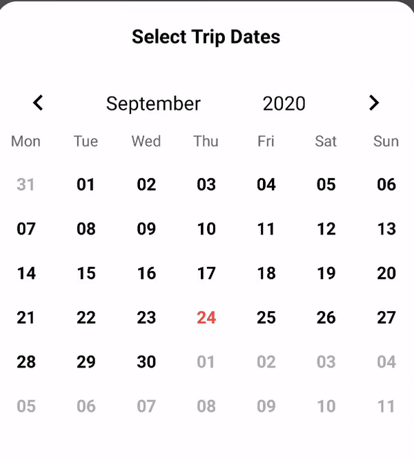

# React Native Customize Selected Date Version 2

This module is the newest version of the previous one, there are some changes in styling and some functions.
Thanks for the author of React Native Customize Selected Date.
previous module download here!
https://github.com/hungdev/react-native-customize-selected-date


<p align="center">
  <a href="https://reactjs.org/">
    
    
  </a>
  
</p>


</h1>

Github : https://github.com/arwysyah/react-native-customize-selected-date-v2

NPM : https://www.npmjs.com/package/react-native-customize-selected-date-v2
<br/>

<br/>

<p align="center">
 
  </a>
  <a href="#">
    
  </a>
  <a href="https://github.com/arwysyah?tab=followers">
    
  </a>
  <a href="https://github.com/prettier/prettier"></a>

</p>

<p align="center">
  
</p>

# Install

```js
npm install react-native-customize-selected-date-v2 --save


```

# Usage:

```javascript

import React, { Component } from 'react';
import { Platform, StyleSheet, Text, View } from 'react-native';
import DateTime from 'react-native-customize-selected-date-v2'

export default class App extends Component {
  constructor(props) {
    super(props)
    this.state = {
      date:[]
    }
  }
  onChangeDate(date) {
    // alert(date);
    const today = new Date();

    if (new Date(date) <= today) {
      return Alert.alert(
        'Oops',
        'can not go back from today',
      );
    } else if (this.state.date.includes(date)) {
      this.removeDate(date);
    } else {
      this.setState({
        date: [...this.state.date, date].sort(function(a, b) {
          return a < b ? -1 : a > b ? 1 : 0;
        }),
      });
    }
  }
  removeDate(selectedDate) {
    let filteredArray = this.state.date.filter(item => item !== selectedDate);
    this.setState({date: filteredArray});
  }
  renderChildDay(day) {
    if (_.includes(this.state.date, day)) {
      return <View style={styles.icLockRed} />;
    }
  }

  render() {
    return (
      <View style={styles.container}>
          <DateTime
              containerStyle={{top: -40}}
              warpDayStyle={{backgroundColor: 'white'}}
              textDayStyle={{color: 'black'}}
              notCurrentDayOfMonthStyle={{color: '#adadad'}}
              currentDayStyle={{color: '#FA4B41', fontWeight: 'bold'}}
              dateSelectedWarpDayStyle={{backgroundColor: 'red'}}
              changeDate={date => this.onChangeDate(date)}
              format="YYYY-MM-DD"
              renderChildDay={day => this.renderChildDay(day)}
            />
      </View>
    );
  }
}

const styles = StyleSheet.create({
  container: {
    flex: 1,
  },
  icLockRed: {
    width: 40,
    height: 40,
    position: 'absolute',
    alignSelf: 'center',
    borderRadius: 20,
    backgroundColor: '#A1DD70',
  },
});


```

# Props

Property | Type | Description
------------ | ------------- | -------------
date | PropTypes.string | Default date
changeDate | PropTypes.func | function call back after select date
format | PropTypes.array | Format date output
renderChildDay | PropTypes.func | return child element injected to date
customWeekdays | PropTypes.func | Array Weekdays, default: ['Sun', 'Mon', 'Tue', 'Wes', 'Thu', 'Fri', 'Sat']
renderPrevYearButton | PropTypes.func | Render function for customize prev year button
renderPrevMonthButton | PropTypes.func | Render function for customize prev month button
renderNextYearButton | PropTypes.func | Render function for customize next year button
renderNextMonthButton | PropTypes.func | Render function for customize next year button


# Styles

Property | Type | Description
------------ | ------------- | -------------
containerStyle | PropTypes.object | Container Style
warpRowControlMonthYear | PropTypes.object | Style for row control next or prev month, year.
warpRowWeekdays | PropTypes.object | Warp row weekdays style
weekdayStyle | PropTypes.object | Weekday text style
warpDayStyle | PropTypes.object | Style for each day in month
dateSelectedWarpDayStyle | PropTypes.object | Style for selected day in month
textDayStyle | PropTypes.object | Style for text day in month
currentDayStyle | PropTypes.object | Style for text current day in month
notCurrentDayOfMonthStyle | PropTypes.object | Style for text when day is not current day in month


# Note

Pull requests are welcome!

- Author Account

```bash
hungdev and team
Arwy Syahputra Siregar
github.com/arwysyah

```
